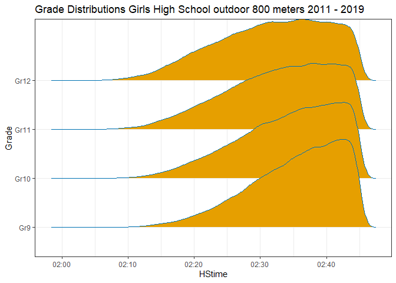
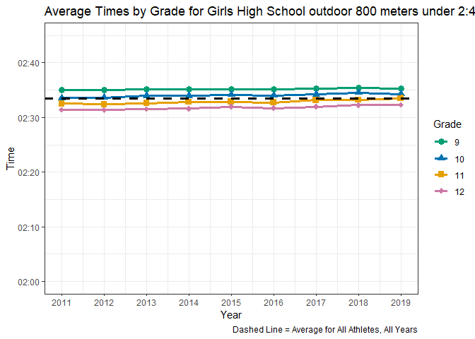
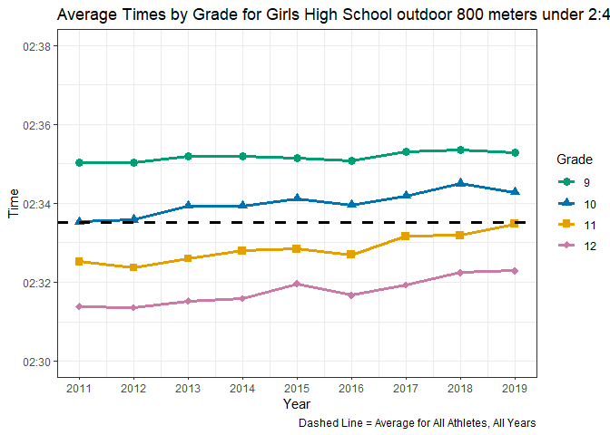
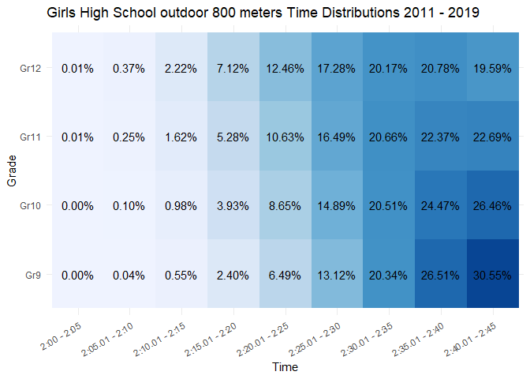

## **1. OVERVIEW Girls High School outdoor 800 meters**    

I looked at results from the Girls High School outdoor 800 meters from 2011 - 2019. A time of 2:45 was used as the cutoff point. 

The  distribution of the best time for each runner each year is shown in Figure 1. On the right hand side of the graph you may notice a steep dropoff; this merely reflects that I did not look at times slower than 2:45.

   

Figure 1  
<!-- -->

   

Looking at 9th graders, we see a peak somewhere to the right of 2:40. We see a narrower curve than we do for other grades, indicating that most freshman girls in the 800m have results that are similar to each other. We also notice there is a smaller tail to the left-hand side than there is for, say, seniors. This makes sense as very few freshman are running 2:15 or below.

Contrast the curve for 9th graders to that of 12th graders. For 12th graders, the peak is a longer area between somewhere around 2:30 and somewhere to the right of 2:40. A senior is about as likely to run a 2:30 as she is to run a 2:40, whereas a freshman is much more likely to run a 2:40 than a 2:30. This makes sense because in general, you would expect improvement from freshman to senior year. This shows, as you might expect, that by the time the runners become seniors they, as a group, have improved their times. We also notice a longer left-hand side tail for the 12th graders, showing that more runners are achieving the elite times as seniors than they do earlier in their high school careers.

Similarly, you can look at the curves of sophomores and juniors in Figure 1 to see the progression as the athletes practice and compete and gain experience over time.

### **1B Long Term Averages Girls High School outdoor 800 meters**    

Figure 2 depicts average performance for each grade level, for each year, for all runners who ran faster than 2:45. 

   

Figure 2  
<!-- -->

   

Figure 2 does show that, though there are distinct differences in averages for each grade level, those differences are rather small. We see that freshmen girls have tended to average around 2:35, senior girls have tended to average around something like a 2:31 or 2:32, and sophomores and juniors are in between. Also, we see that the overall average for all runners over all years is somewhere around a 2:33 or 2:34, as depicted by the black dashed line. As a whole, while there are certainly differences by grade level year after year, these differences are relatively small.

For fun, let's zoom in on Figure 2 and see if we can notice anything else. Figure 3 is the zoomed-in version of Figure 2.

   

Figure 3  
<!-- -->

   

In Figure 3, we see the progression in improvement from 9th graders to 12 graders. Consistently year-in and year-out, as a group seniors are faster than juniors are faster than sophomores, who are faster than freshmen. 

Looking solely at the graph, one might conclude that runners are getting slower over time. The trend for seniors, for instance, shows that in 2011 the average time was around 2:31.5, while in 2019 it shows the average time to be something around 2:32.25. I do not think that runners are necessarily getting slower. I do think this shows a data capture issue. In 2019, electronic timing at many high school track meets was much more prevalent than it was in 2011. More data being captured is a good thing, and the true averages are probably closer to the 2019 levels than the 2011 levels.

   

### **1C Distributions Girls High School outdoor 800 meters**    

Figure 4 shows the percentage of runners, by grade level, whose results were in various time "buckets". For instance, the top row shows that 0.01% of all seniors who ran 2:45 or better in 2011 - 2019 ran anywhere from 2:00 to 2:05. Intuitively, this makes sense. Only the elite of the elite would achieve such an incredible result. Staying in the top row, and looking a little to the right, we see that 12.46% of all seniors who ran 2:45 or better in 2011 - 2019 ran between 2:20.01 - 2:25.00. If we look at the same time bucket (2:20.01 - 2:25.00) for 9th graders, we see that 6.49% of all 9th graders ran 2:45 or better  in 2011 - 2019. Again, this makes sense that many more seniors than freshman would run such an excellent time. At that age, the three-year advantage that seniors have over freshman in terms of training and conditioning really shows. Figure 4 quantitatively shows the difference. 

   

Figure 4  
<!-- -->

   

